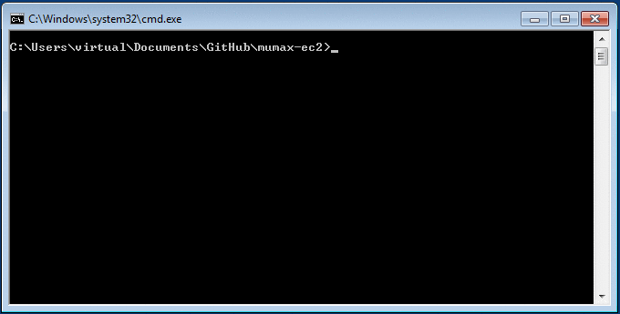

MuCloud
=========

This software allows [MuMax3](http://mumax.github.io/) GPU-accelerated micromagnetic simulations to be run on a computer without a GPU card. With your [Amazon Web Services](http://aws.amazon.com/) (AWS) account, virtual computer instances are created using the [Elastic Compute Cloud](http://aws.amazon.com/ec2/) (EC2). These instances provide on-demand ([price per hour](http://aws.amazon.com/ec2/pricing/)) access to physical GPU hardware, that allow the simulations to be run remotely. The script interface mimics MuMax3 and also forwards the web-based interface, so working with MuMax-EC2 is as easy as MuMax3.

**Authors:** Colin Jermain, Graham Rowlands  
**License:** [MIT License](http://opensource.org/licenses/MIT)

**Instructions:** http://ralph-group.github.io/mucloud

**Requirements:**   
    Amazon Web Services account   
    Python 2.7   

Below is an example of running Standard Problem 4 with MuMax-EC2 on a Windows machine.

