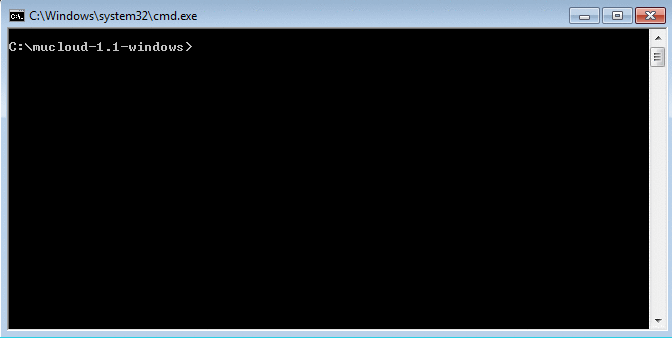

## MuCloud ##

This software allows [MuMax3](http://mumax.github.io/) GPU-accelerated micromagnetic simulations to be run on a computer without a GPU card. With your [Amazon Web Services](http://aws.amazon.com/) (AWS) account, virtual computer instances are created using the [Elastic Compute Cloud](http://aws.amazon.com/ec2/) (EC2). These instances provide on-demand ([price per hour](http://aws.amazon.com/ec2/pricing/)) access to physical GPU hardware, that allow the simulations to be run remotely. The script interface mimics MuMax3 and also forwards the web-based interface, so working with MuCloud is as easy as MuMax3.

Authors: Colin Jermain, Graham Rowlands  
License: [MIT License](license.md)   
Source code: [ralph-group/mucloud](http://www.github.com/ralph-group/mucloud) on GitHub

## Installing ##

MuCloud requires an AWS account and Python 2.7. Instructions for setting up and installing the program are provided depending on your operating system.

<table>
    <tr>
        <td style="padding-right: 1em; text-align: center">
            <a href="install_linux.md" style="color: #153549; text-decoration: underline">
            

                <i class="fa fa-linux"></i>
            

            Linux
            </a>
        </td>
        <td style="padding-right: 1em; text-align: center">
            <a href="install_mac.md" style="color: #153549; text-decoration: underline">
            

            <i class="fa fa-apple"></i>
            
 
            MacOSX
            </a>
        </td>    
        <td style="padding-right: 1em; text-align: center">
            <a href="install_windows.md" style="color: #153549; text-decoration: underline">
            

                <i class="fa fa-windows"></i>
            

            Windows
            </a>
        </td>
    </tr>
</table>

## Usage ##

A [full tutorial](tutorial.md) is provided to get you started that covers all the functionality of the program. 

Below is an example of running Standard Problem 4 with MuCloud on a Windows machine.

