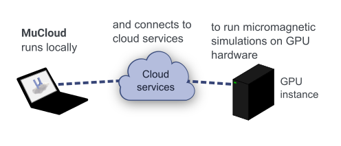
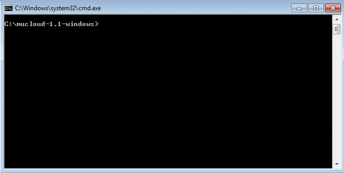

MuCloud
=======

.. warning::  Many changes have occurred since this tool was developed, in both AWS and Python. This project is not being actively maintained and will be archived for further reference. We hope that it still provides a useful example for how to run simulations on cloud resources.

MuCloud runs `MuMax3`_ GPU-accelerated micromagnetic simulations on the cloud, eliminating the need to have a GPU card on your computer. 

With your `Amazon Web Services`_ (AWS) account, virtual computer instances are created using the `Elastic Compute Cloud`_ (EC2). These instances provide on-demand (`price per hour`_) access to physical GPU hardware, that allow the simulations to be run remotely. The script interface mimics MuMax3, so that working with MuCloud is as easy as using MuMax3 on a local computer.

.. _MuMax3: http://mumax.github.io/
.. _Amazon Web Services: http://aws.amazon.com/
.. _Elastic Compute Cloud: http://aws.amazon.com/ec2/
.. _price per hour: http://aws.amazon.com/ec2/pricing/
.. _MIT License: license.html

Citing
------
If you make significant use of this program, we kindly ask that you cite:

    *GPU-accelerated micromagnetic simulations using cloud computing*, `arXiv:1505.01207`__ (2015)

The code is written and maintained by `Colin Jermain`_ and `Graham Rowlands`_ from Cornell University in the `Ralph`_ and `Buhrman`_ research groups. MuCloud is open-source software, released under the `MIT License`_.

.. __: http://arxiv.org/abs/1505.01207
.. _Colin Jermain: https://github.com/cjermain
.. _Graham Rowlands: http://www.grahamerowlands.com/
.. _Ralph: http://ralphgroup.lassp.cornell.edu/
.. _Buhrman: http://buhrman.research.engineering.cornell.edu/

Usage
-----
A `full tutorial`_ is provided to get you started that covers all the functionality of the program. Below is an example of running Standard Problem 4 with MuCloud on a Windows machine.

.. _full tutorial: tutorial.html

.. toctree::
   :hidden:
   :maxdepth: 2
   
   install
   setup
   tutorial
   faq
   changelog
   license
