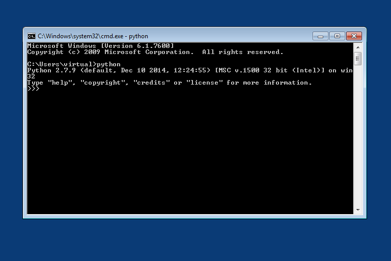

## Installing on Windows ##

Instructions for installing the necessary Python libraries and MuMax-EC2 on Windows are provided.

### Installing Python ###
Download the latest release of [Python 2.7](https://www.python.org/downloads/) (currently 2.7.9 as of 1/23/15). Version 2.7.9 comes with the pip installer, which is required for installing the necessary libraries. If you already have Python 2.7 and want to install pip separately, follow [these instructions](https://pip.pypa.io/en/latest/installing.html#install-pip).

In the Python 2.7 installer, under "Customize Python 2.7", ensure "Add python.exe to path" is included.


Download and install the [Microsoft Visual C++ Compiler for Python 2.7](http://www.microsoft.com/en-in/download/confirmation.aspx?id=44266). This allows the Python pip installer to compile required C/C++ code that is included in some Python packages.

Restart your computer.

Open the command prompt (cmd) and verify that Python is installed properly.

```dos
python
```



To exit the Python interpreter type `exit()`.

Now you have the required Python environment.


### Installing MuMax-EC2 ###
First, download the [latest release from GitHub](https://github.com/ralph-group/MuMax-EC2/releases). Extract the files in a good place and open a command prompt in that directory.

```dos
cd C:\path\to\mumax-ec2
```

Use the pip installer to install the required Python packages.

```bash
pip install -r requirements.txt
```

Now you have MuMax-EC2 installed. The next step is to [set up the configuration file](setup_aws.md) with your AWS settings to allow access to your account.