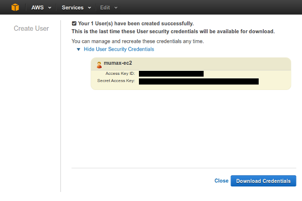
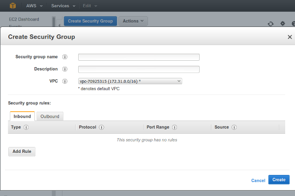

## Setting up AWS ##

Instructions for setting up your Amazon Web Services (AWS) account to use with MuCloud are provided.

### Making a user ###

Begin by [signing up](https://console.aws.amazon.com/console/home) for an Amazon Web Services account.


After your account has been created, open the [AWS Console](https://console.aws.amazon.com/console/).


Since the Amazon machine instance (AMI) for MuCloud is in the US East (N. Virginia) region, choose that region in the upper right hand dropdown.


Choose IAM (Identity and Access Management) > Users > Create New Users.


Create a user "mucloud" (leave "Generate access key for each user" checked). Show the User Security Credentials, and copy the "Access Key ID" (`AccessID`) and "Secret Access Key" (`SecretKey`) into the MuCloud `config.ini` that came with the latest release. 



Download the credentials and keep them in a safe place. Close to return to the Users menu.

Under Users > mucloud, Attach User Policy.


Search and select "AmazonEC2FullAccess". Attach this policy to the "mucloud" user.


> Now your "mucloud" user has been created and has full permission to use EC2, without allowing access to any other AWS services for security reasons.

### Getting a private key ###

From the AWS Console, open up EC2.


Choose Key Pairs > Create Key Pair. Create a key pair with name "mucloud", and update `config.ini` (`PrivateKeyName`) with this name.


Download the `.pem` file and save it to a safe place. On Linux and MacOSX change the permissions of the `.pem` file to prevent others from reading it.

```bash
chmod 500 mucloud.pem
```

Update `config.ini` with the path of the `.pem` private key (`PrivateKeyFile`). Now you have a private key with which you can connect to your instance with SSH.

### Creating a security group ###

From EC2, choose Security Groups > Create Security Group.



Set the security group name to "mucloud", and update `config.ini` (`SecurityGroups`) with this name. A description is required by AWS. On the Inbound tab > Add Rule > "Type: SSH".

For the best security, choose "Source: My IP". Note that if your IP changes, **you will have to edit the security group again to update the IP.** Alternatively "Source: Anywhere" can be used.

After you create the security group, your AWS account has been set up properly and your `config.ini` file has been updated. The next step is to start using MuCloud, or [follow the tutorial](tutorial.md) to get started.