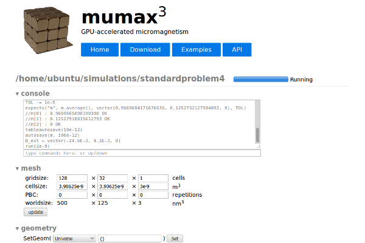

## Tutorial ##

After installing MuCloud ([Linux](install_linux.md), [MacOSX](install_mac.md), [Windows](install_windows.md)) and [setting up your Amazon Web Services (AWS) account](setup_aws.md) you are ready to start the tutorial.

### Reminder about AWS billing ###

Throughout using MuCloud, remember that your AWS account will be [charged per hour](http://aws.amazon.com/ec2/pricing/) for each running instance (g2.2xlarge). Fractional hours are billed as full hours. When instances are stopped, you will be [charged a small storage fee](http://docs.aws.amazon.com/AWSEC2/latest/UserGuide/Stop_Start.html) for the instance volume. The best practice is to terminate any instance that you are not using to halt charges.

### Reporting an error ###

If you experience any error in the the operation of MuCloud, make sure to first stop or terminate your instances as appropriate. This can be done manually in the [AWS Console](https://console.aws.amazon.com/console/), under EC2 > Instances.

Errors should be reported through GitHub on our [Issues page](https://github.com/ralph-group/mucloud/issues).

### Accessing the help menu ###

Open a terminal or command prompt and change the directory to where you have stored the MuCloud software. First lets start by accessing the help menu, where you can look for assistance on the command syntax.

```bash
$ python mucloud.py --help
usage: mucloud.py [-h] {run,list,launch,terminate,stop,start,reattach} ...

Runs MuMax3 .mx3 files on Amazon Web Services (AWS) instances

positional arguments:
  {run,list,launch,terminate,stop,start,reattach}
                        sub-command help
    run                 run help
    list                list help
    launch              launch help
    terminate           terminate help
    stop                stop help
    start               start help
    reattach            reattach help

optional arguments:
  -h, --help            show this help message and exit
```

Specific help on commands is accessed in the following way.
```bash
$ python mucloud.py run --help
```

### Running a simulation ###

Simulations are run by passing a MuMax3 .mx3 file to a running GPU instance. The run command automatically selects an existing and ready instance, or prompts you to start one. For now, lets assume you do not have any instances started.

Pass the file path of the .mx3 file into the `run` command. If you do not already have a simulation you can use [Standard Problem 4](https://raw.githubusercontent.com/mumax/3/arne/test/standardproblem4.mx3), implemented by MuMax3.

```bash
$ python mucloud.py run ../tests/standardproblem4.mx3
There are no instances waiting to be used.
Create a new instance for this job? [Yn]: 
```

Answer Yes (Y) to create a new instance.

```bash
Creating a new instance i-d046242d from image ami-3437145c
Waiting for instance to boot...
```
There will be a boot time (typically 1 min) since you are starting up the instance. This can be avoided by [starting an instance before using the run command](#starting-an-instance).

If you have trouble making a secure connection, make sure that your IP address is included in the security group as was described in the [instructions on setting up your AWS account](setup_aws/#creating-a-security-group).

```bash
Instance i-d046242d is ready
Making secure connection to instance i-d046242d...
Transferring input file to instance: standardproblem4.mx3
Starting port forwarding: http://127.0.0.1:35367
```
At this point your instance has the simulation file and is about to be started. The software forwards the MuMax3 web-interface, which is accessible through your local browser on [http://127.0.0.1:35367](http://127.0.0.1:35367). This port can be changed by using the `--port` flag of the `run` command.



Now the MuMax3 output is forwarded as the simulation runs. You can interrupt the execution of the simulation using `Ctrl-C` to cause a keyboard interrupt. Be careful to only use this functionality when you are within the MuMax3 output, as it may otherwise interrupt the normal simulation. This will prompt you to choose between either [detaching from the simulation](#detaching-from-an-instance) (D), aborting the simulation (a), or continuing to run (c).
```
==================== MuMax3 output ====================
//output directory: /home/ubuntu/simulations/standardproblem4.out/
starting GUI at http://127.0.0.1:35367
setgridsize(128, 32, 1)
setcellsize(500e-9/128, 125e-9/32, 3e-9)
Msat = 1600e3
Aex = 13e-12
E_total.get()
Calculating demag kernel 1 %
Calculating demag kernel 100 %
^C

Caught keyboard interrupt during simulation
Detach, abort, or continue the simulation? [Dac]: 
```

For now, lets continue if you have interrupted the simulation.

```
Continuing the simulation
==================== MuMax3 output ====================
//output directory: /home/ubuntu/simulations/standardproblem4.out/
starting GUI at http://127.0.0.1:35367
setgridsize(128, 32, 1)
setcellsize(500e-9/128, 125e-9/32, 3e-9)
Msat = 1600e3
Aex = 13e-12
E_total.get()
Calculating demag kernel 1 %
Calculating demag kernel 100 %
Msat = 800e3
alpha = 0.02
m = uniform(1, .1, 0)
relax()
save(m)
TOL := 1e-5
expectv("m", m.average(), vector(0.9669684171676636, 0.1252732127904892, 0), TOL)
//m[0] : 0.9669663906097412 OK
//m[1] : 0.12527959048748016 OK
//m[2] : 0 OK
tableautosave(10e-12)
autosave(m, 100e-12)
B_ext = vector(-24.6E-3, 4.3E-3, 0)
run(1e-9)
expectv("m", m.average(), vector(-0.9846124053001404, 0.12604089081287384, 0.04327124357223511), TOL)
//m[0] : -0.9846120476722717 OK
//m[1] : 0.12604430317878723 OK
//m[2] : 0.043269284069538116 OK
==================== MuMax3 output ====================
Stopping port forwarding
Receiving output files from instance
Removing simulation output from instance                             
Removing input file from instance
Removing logs from instance
Terminate the instance? [Yn]:
```
The data files have already been transfered to the same directory that contained your .mx3 file. At this point you are asked to terminate the instance. Answering Yes (Y) will permanently remove the instance and its storage. Answering No (N), will give you the option to either keep the instance running or stop the instance. In the case the instance is stopped, you will not be charged for the hourly rate, but will incur minor storage fees for the volume. Keeping the instance running allows you to avoid the boot up time on a subsequent simulation. Remember that instances that are not shut down will continue to charge an hourly rate, and it is your responsibility to properly stop or terminate instances.

### Listing instances ###

The importance of knowing what instances are running and which are stopped prompted the `list` command. This allows you to examine the AWS ID, IP addresses, state of instances, including the port and file of running simulations.

```bash
$ python mucloud.py list
MuCloud Instances:
    ID          IP          State       Port        File
    i-c253313f  52.4.70.180 simulating  35367       standardproblem4.mx3
    i-eac3f310  None        stopped     
```
Above you can see that one instance (AWS ID: i-c253313f) is simulating `standardproblem4.mx3` with the web-interface displaying on your local port 35367. Another instance (AWS ID: i-eac3f310) is stopped and can be started for future use.

### Starting an instance ###

Since the boot up time takes a minute, instances can be started directly and independent of the `run` command. There are two methods for starting instances: (1) starting a new instance, and (2) starting a stopped instance using the AWS ID.

#### (1) Starting a new instance ####
```bash
$ python mucloud.py launch
```
The optional `--wait` flag keeps the command from returning until the instance is started.

#### (2) Starting a stopped instance ####
```bash
$ python mucloud.py start i-ab9a7c51
```

After (2), we can interrogate the instances to see that i-ab9a7c51 is now ready.

```bash
$ python mucloud.py list
MuCloud Instances:
    ID          IP          State       Port        File
    i-ab9a7c51  52.1.87.187 ready
```

A subsequent `run` command will automatically use instance i-ab9a7c51 since it is ready.
```bash
$ python mucloud.py run ./tests/standardproblem4.mx3
Instance i-ab9a7c51 is ready
Making secure connection to instance i-ab9a7c51...
Transferring input file to instance: standardproblem4.mx3
...
```

### Stopping an instance ###

Stopping an instance can be achieved through the `stop` command by passing the AWS ID.

```bash
$ python mucloud.py stop i-ab9a7c51
```

### Terminating an instance ###

Terminating an instance is the recommend way to deal with instances upon simulation completion, unless further simulations will immediately follow.

```bash
$ python mucloud.py terminate i-ab9a7c51
```

### Detaching from an instance ###

For long running simulations, keeping an open connection to the instance may be prohibitive. The detached mode allows the simulations to continue to run even without the MuCloud program connected. The simulation must be [reattached to](#reattaching-to-an-instance) at a later time in order to retrieve the simulation output. There are two methods for using the detached mode: (1) detaching from a running simulation, and (2) starting a simulation in detached mode.

#### (1) Detaching from a running simulation ####

As described when [running a simulation](#running-a-simulation), using `Ctrl-C` during the simulation causes a keyboard interrupt. Choose to detach (D) when prompted after the keyboard interrupt.

```
Caught keyboard interrupt during simulation
Detach, abort, or continue the simulation? [Dac]: D
Detaching from instance with simulation running
Reattach with: python mucloud.py reattach i-fca5c701
==================== MuMax3 output ====================
Stopping port forwarding
```

#### (2) Starting a simulation in detached mode ####

Use the `--detach` flag with the `run` command to automatically go into the detached mode when starting a simulation.

```
$ python mucloud.py run tests/standardproblem4.mx3 --detach
Instance i-fca5c701 is ready
Making secure connection to instance i-fca5c701...
Transferring input file to instance: standardproblem4.mx3
Starting port forwarding: http://127.0.0.1:35367
Running standardproblem4.mx3 on MuMax3
Stopping port forwarding
Detaching from instance with simulation running
Reattach with: python mucloud.py reattach i-fca5c701
```

### Reattaching to an instance ###

After [detaching from an instance](#detaching-from-an-instance), it is necessary to reattach to retrieve the output files. If the simulation has not yet finished, the MuMax3 output will be updated in the same way as the `run` command.

```
$ python mucloud.py reattach i-fca5c701
Reconnecting to running instance
Making secure connection to instance i-fca5c701...
Starting port forwarding: http://127.0.0.1:35367
...
```

### Next steps ###

Now you are familiar with all the commands that MuCloud supports, and are ready to start simulations. If you have further questions about the operation, consult the [source code](https://github.com/ralph-group/mucloud) or [report an issue](https://github.com/ralph-group/mucloud/issues/) on GitHub.